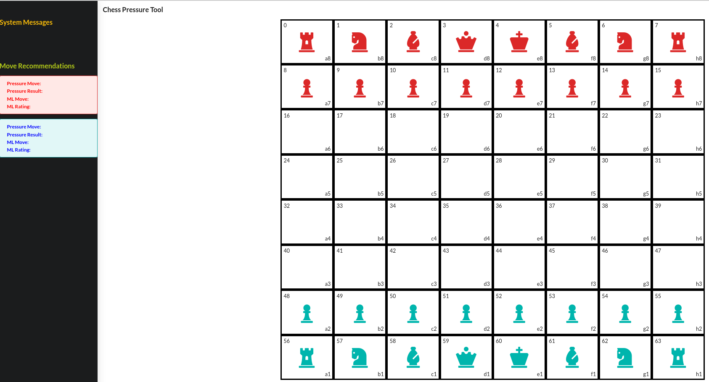

# Getting Started

This application has two parts: A ReactJS app for the front end and a Python Flask app as the back end. To use this
app, both the ReactJS and Python app need to be running.

## Setting up Node and ReactJS

Start by ensuring __nodeJS__ is installed. Once __nodeJS__ is installed, clone this repo to your machine then run the following 
command to install the packages.
```
npm install
```

Assuming there are no issue installing the required packages, run the following command to start the react app.
```
npm start
```

After executing the command, the font end should start and this webpage will be shown



## Setting up Python and Flask

The python flask app performs all the heavy calculations. Start by verifying  __python 3.9__ and _pip_ are installed then 
execute the following command

```
pip install -r requirements.txt
```

This will install the required packages for the application. Next start the application _from the project directory_ by 
executing

```
python backend/app.py
```

# Usage

Use the app by clicking a piece then clicking where that piece should be moved to. When doing this, the front end will
send the data to backend to perform some calculations. These calculations will be returned in the form of move recommendations
and pressure visualizations for the users.


